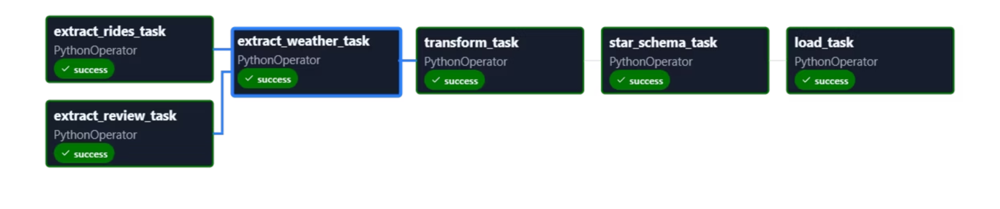
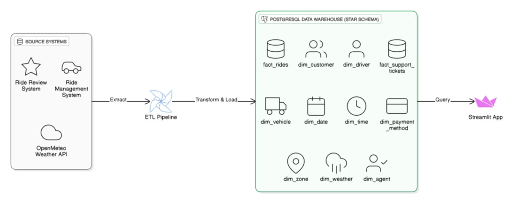

# Ride Sharing Data Warehouse & BI Platform


A comprehensive data warehouse and business intelligence platform for ride-sharing operations, featuring ETL pipelines, analytics dashboards, and machine learning predictions.

## 📋 Overview

This project implements a complete data pipeline for a ride-sharing service (similar to Uber/Lyft), from raw data extraction to actionable business insights. It combines Apache Airflow for ETL orchestration, Streamlit for interactive analytics, and machine learning models for predictive analytics.

## 🏗️ Architecture

### Data Flow


The system follows a traditional ETL (Extract, Transform, Load) architecture:

1. **Extract**: Pull data from multiple sources (rides, customer reviews, weather data)
2. **Transform**: Clean, normalize, and enrich the data
3. **Model**: Build star schema for analytical queries
4. **Load**: Populate PostgreSQL data warehouse

### System Architecture


The platform consists of:
- **ETL Pipeline**: Apache Airflow orchestrates data processing
- **Data Warehouse**: PostgreSQL with star schema design
- **Analytics UI**: Streamlit-based dashboard for visualizations
- **ML Engine**: Scikit-learn models for predictions

## ✨ Features

### 📊 Analytics Dashboard
- Ride demand analysis by time/location
- Revenue metrics and KPIs
- Weather impact on operations
- Support ticket insights
- Customer and driver analytics

### 🤖 Machine Learning Predictions
- **Demand Forecasting**: Predict ride requests by zone and hour
- **Fare Prediction**: Estimate trip costs
- **Customer Segmentation**: Cluster users by behavior
- **High-Risk Zone Detection**: Identify problematic areas
- **Duration Prediction**: Estimate trip times

### ⚙️ ETL Pipeline Control
- Manual trigger of data pipelines
- Monitor pipeline status
- View logs and execution history

### 📝 Data Management
- Single record insertion
- Batch CSV uploads
- Real-time data validation

## 🛠️ Tech Stack

### Backend
- **Python 3.12**
- **Apache Airflow**: ETL orchestration
- **PostgreSQL**: Data warehouse
- **MySQL**: Source databases
- **Pandas**: Data processing
- **SQLAlchemy**: ORM

### Frontend
- **Streamlit**: Web interface
- **Plotly**: Interactive visualizations

### ML/AI
- **Scikit-learn**: Machine learning models
- **Joblib**: Model serialization

## 🚀 Installation

### Prerequisites
- Docker & Docker Compose
- Python 3.8+
- Git

### Setup Steps

1. **Clone the repository**
   ```bash
   git clone <repository-url>
   cd dwbi
   ```

2. **Install dependencies**
   ```bash
   # For the Streamlit app
   cd "DWBI App"
   pip install -r requirements.txt

   # For the Airflow ETL (if using Astronomer)
   cd "../DWBI Project"
   astro dev start
   ```

3. **Configure databases**
   - Set up PostgreSQL for the data warehouse
   - Configure MySQL connections for source data
   - Update connection strings in config files

4. **Run the application**
   ```bash
   # Start the Streamlit app
   cd "DWBI App"
   streamlit run app.py

   # Access at http://localhost:8501
   ```

## 📖 Usage

### ETL Pipeline
1. Navigate to the ETL Pipeline Control page
2. Trigger data extraction and processing
3. Monitor pipeline execution in Airflow UI

### Analytics
1. Use the Analytics Dashboard to explore metrics
2. Filter data by date ranges, zones, and categories
3. Export visualizations as needed

### ML Predictions
1. Access ML Predictions page
2. Input parameters for forecasting
3. View predictions and model performance metrics

## 📁 Project Structure

```
DWBI/
├── DWBI App/                    # Streamlit frontend
│   ├── app.py                   # Main application
│   ├── pages/                   # Dashboard pages
│   ├── ml_models/               # Trained ML models
│   └── requirements.txt
├── DWBI Project/                # Airflow ETL backend
│   ├── dags/                    # Airflow DAGs
│   │   ├── ETL.py              # Main ETL pipeline
│   │   ├── extraction.py       # Data extraction logic
│   │   ├── transformation.py   # Data transformation
│   │   └── load.py             # Data loading
│   ├── data/                   # Extracted/transformed data
│   └── requirements.txt
├── output/
│   ├── DataArchitectureDiagram.png  # Architecture diagram
│   ├── ETLPipeline.png             # ETL flow diagram
│   └── RideDemandAnalysis.png      # Demand analysis chart
└── README.md
```

## 🤝 Contributing

1. Fork the repository
2. Create a feature branch (`git checkout -b feature/new-feature`)
3. Commit your changes (`git commit -am 'Add new feature'`)
4. Push to the branch (`git push origin feature/new-feature`)
5. Create a Pull Request

